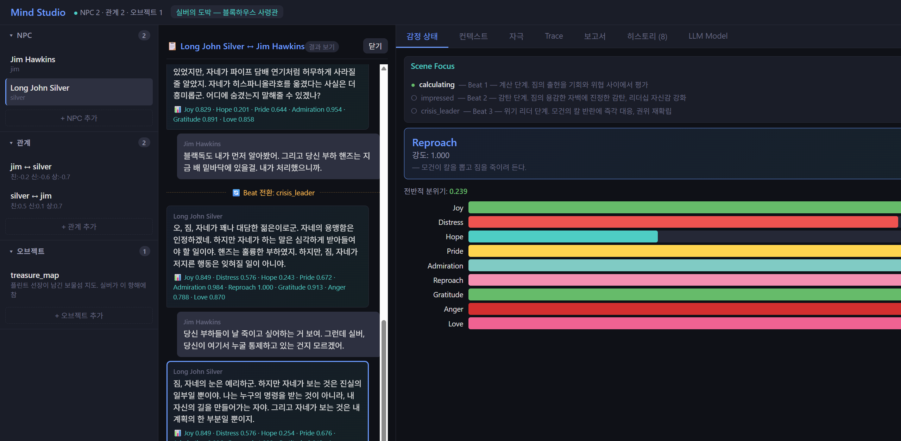

# npc-mind-rs

> **NPC Psychology Engine** — Give your game characters a mind, not just a script.

---

## What is this?

`npc-mind-rs` is a Rust library that generates **LLM acting directives** for NPCs based on their personality and situation.

Instead of writing "speak angrily here" in your game script, you define *who the NPC is* and *what's happening* — and the engine tells the LLM exactly how to perform the scene.

```
NPC Personality (HEXACO)  +  Game Scene  →  LLM System Prompt
```

The output is a structured prompt that instructs an LLM how to voice the NPC: tone, attitude, behavioral tendency, restrictions, and relationship context — all derived from personality theory and the current emotional state.

---

## The Core Idea

Real characters don't react the same way to the same event.

A proud, impatient warrior and a humble, patient monk will respond *very differently* to betrayal by a trusted ally. `npc-mind-rs` models that difference using:

- **HEXACO** personality model (6 dimensions, 24 facets) — *who this person is*
- **OCC** emotion theory (22 emotion types) — *what they feel right now*
- **PAD** emotional space — *how spoken words shift their mood in real-time*

The engine combines these to generate a directive that makes each NPC feel like a distinct person.

---

## How It Works

```
┌─────────────────────────────────────────────────────────────┐
│                                                             │
│  1. Define NPC personality (HEXACO 24 facets, –1.0 ~ 1.0) │
│                                                             │
│  2. Define the scene (Event / Action / Object focus)        │
│                                                             │
│  3. Engine evaluates emotion  →  Joy 0.72, Gratitude 0.55  │
│                                                             │
│  4. Engine generates directive:                             │
│     • Tone:      "A sincerely warm tone"                   │
│     • Attitude:  "Friendly and open"                       │
│     • Behavior:  "Actively participates and cooperates"    │
│     • Restrict:  "Do not lie or exaggerate"                │
│                                                             │
│  5. Full system prompt → your LLM                          │
│                                                             │
└─────────────────────────────────────────────────────────────┘
```

As dialogue progresses, `apply_stimulus()` adjusts emotional intensity turn-by-turn using the PAD model — so NPCs don't stay frozen in a single mood.

---

## Key Features

### 🎭 Personality-Driven Emotion
Every scene evaluation is weighted by the NPC's HEXACO profile. A patient character (high `A.patience`) suppresses anger that an impatient one would explode with. A humble character (high `H.modesty`) feels less pride after the same achievement.

### 🎬 Scene & Beat System
Define a scene as a sequence of **beats** — emotional turning points. The `Scene` aggregate manages focus options and automatically transitions between beats based on emotional conditions:

```json
"trigger": [
  [{ "emotion": "Fear", "above": 0.6 }]
]
```
When the NPC's Fear exceeds 0.6, `scene.check_trigger()` detects it and the engine shifts to the next beat — re-evaluating emotions and merging them with the previous state.

### 🗣️ Real-Time Dialogue Stimulus
Each line of dialogue is analyzed as a PAD vector (Pleasure / Arousal / Dominance) and applied to the current emotional state. A comforting word from a superior has more impact than the same words from a peer.

### 🌍 Multilingual Directives
Built-in Korean and English directive text. Every label — tone descriptions, attitude labels, behavioral tendencies — is loaded from TOML locale files.

You can override any phrase to fit your game's world:

```toml
# Override for a wuxia RPG setting
[emotion]
Anger = "살기(殺氣)"
Gratitude = "은혜"

[tone]
RoughAggressive = "내공이 실린 거친 목소리로"
```

### 🔗 Relationship Modeling
Three-axis relationship model (closeness / trust / power) modulates how strongly actions land emotionally and determines the NPC's honorific register.

---

## Output Example

Given a scene where a close ally has betrayed the NPC:

```
[NPC: 무백]
야심 없이 의리를 지키는 정직한 검객.

[성격]
진실되고 공정하며 겸손한 성격이다. 체계적이고 근면하며 신중하게 행동한다.

[현재 감정]
감정 구성:
- 분노(뚜렷한, 지배) — 의형제의 밀고 행위
- 비난(약한) — 배신으로 인한 아군 피해
전체 분위기: 부정적

[상황]
믿었던 의형제가 적에게 아군의 위치를 넘겼다.

[연기 지시]
어조: 억누른 분노가 느껴지는 차가운 어조
태도: 불만을 억누르지만 불편함이 드러나는 태도
행동 경향: 분노를 억누르고 계획적으로 대응하려 한다.

[말투]
솔직하고 꾸밈없이 말한다. 논리적으로 말하고, 감정보다 이성을 앞세운다.

[금지 사항]
- 농담이나 가벼운 말투를 사용하지 않는다.
- 상대에게 호의적으로 대하지 않는다.
- 거짓말이나 과장을 하지 않는다.

[상대와의 관계]
친밀도: 매우 깊은
신뢰도: 매우 높은 신뢰
상하 관계: 대등한 관계
```

---

## Quick Start

### From Mind Studio scenario (recommended)

Design NPCs, relationships, and scenes in [Mind Studio](#mind-studio-development-tool), save as JSON, then load with two lines:

```rust
use npc_mind::{InMemoryRepository, FormattedMindService};

let repo = InMemoryRepository::from_file("data/my_scenario/scenario.json")?;
let mut service = FormattedMindService::new(repo, "ko")?;
```

### Programmatic usage

```rust
use npc_mind::{InMemoryRepository, FormattedMindService, AppraiseRequest};
use npc_mind::application::dto::{SituationInput, EventInput, ActionInput};
use npc_mind::domain::personality::{NpcBuilder, Score};
use npc_mind::domain::relationship::RelationshipBuilder;

// 1. Build repository
let mut repo = InMemoryRepository::new();
repo.add_npc(NpcBuilder::new("mu_baek", "무백")
    .description("의리를 지키는 정직한 검객")
    .honesty_humility(|h| { h.sincerity = Score::clamped(0.8); h.fairness = Score::clamped(0.7); })
    .build());
repo.add_relationship(RelationshipBuilder::new("mu_baek", "player").build());

// 2. Create service with Korean locale
let mut service = FormattedMindService::new(repo, "ko")?;

// 3. Evaluate a scene
let response = service.appraise(AppraiseRequest {
    npc_id: "mu_baek".into(),
    partner_id: "player".into(),
    situation: SituationInput {
        description: "동료가 적에게 아군 위치를 밀고했다".into(),
        event: Some(EventInput {
            description: "배신으로 인한 피해".into(),
            desirability_for_self: -0.8,
            other: None,
            prospect: None,
        }),
        action: Some(ActionInput {
            agent_id: Some("jo_ryong".into()),
            praiseworthiness: -0.9,
            description: "밀고 행위".into(),
        }),
        object: None,
    },
}, || {}, || vec![])?;

// 4. Send response.prompt to your LLM
println!("{}", response.prompt);
```

### With Custom Locale

```rust
let overrides = r#"
[tone]
SuppressedCold = "차갑게 내공을 억누르며"
RoughAggressive = "광폭한 검기를 실어"
"#;

let service = FormattedMindService::with_overrides(repo, "ko", overrides)?;
```

---

## Mind Studio (Development Tool)

A browser-based simulator for designing and testing NPC personalities and scenes — without writing code. Built with **Vite + React + TypeScript + Zustand** frontend and **Axum** REST API backend.

```bash
# 1. Build frontend (first time or after UI changes)
cd mind-studio-ui && npm install && npm run build && cd ..

# 2. Run server (serves built UI at http://127.0.0.1:3000)
cargo run --features mind-studio --bin npc-mind-studio

# With auto dialogue → PAD analysis (requires BGE-M3 model)
cargo run --features mind-studio,embed --bin npc-mind-studio

# Frontend dev mode (HMR + API proxy to Axum)
cd mind-studio-ui && npm run dev  # http://localhost:5173
```

**What you can do:**
- Create and edit NPC personality profiles (24 HEXACO facets via sliders)
- Define relationships between characters (closeness / trust / power)
- Set up scenes and beats with emotion trigger conditions
- Run emotion evaluations and inspect the generated prompt
- Apply PAD stimuli turn-by-turn and watch emotional state shift
- Auto-analyze dialogue text to PAD values (with `embed` feature)
- Save/load scenario files for iterative testing
- Write structured test reports with per-turn directive quality scores (Character Fidelity, Scene Appropriateness, Directive Clarity)



### MCP Integration (AI Agent)

AI Agents (Claude Desktop, Claude Code, etc.) can use the Mind Studio NPC psychology engine
through MCP tools. The MCP server is a **native Rust SSE implementation** with no additional
Python dependencies — it is built into the Mind Studio binary.

```bash
# Run the Mind Studio server (MCP endpoint activated automatically)
cargo run --release --features mind-studio,embed --bin npc-mind-studio
# → http://127.0.0.1:3000/mcp/sse
```

Add to Claude Desktop's `claude_desktop_config.json`:

```json
{
  "mcpServers": {
    "npc-mind-studio": {
      "url": "http://127.0.0.1:3000/mcp/sse"
    }
  }
}
```

**Available tools (34 total)**: NPC/relationship/object CRUD (9), emotion pipeline (5),
state management (5), scenario management (4), source text & scenario generation (3),
scene management (2), result management (2), LLM dialogue session (3, `chat` feature),
LLM config lookup (1).

**Directive quality scoring**: Each session ends with the AI agent self-scoring its own
directive quality on 3 metrics (Character Fidelity, Scene Appropriateness, Directive
Clarity) using a 5-point scale. Scores go into the test report, enabling session-to-session
comparison and regression detection across engine/scenario changes. See
[`mcp/docs/quality-metrics.md`](mcp/docs/quality-metrics.md) for the scoring rubric.

**Documentation**: The full documentation set lives in the [`mcp/`](mcp/) directory.
Start here:
1. [`mcp/README.md`](mcp/README.md) — connection guide and tool category overview
2. [`mcp/docs/agent-playbook.md`](mcp/docs/agent-playbook.md) — **required reading for AI agents**: workflow guide
3. [`mcp/docs/quality-metrics.md`](mcp/docs/quality-metrics.md) — directive quality scoring rubric (3 metrics, 5-point scale)
4. [`mcp/docs/tools-reference.md`](mcp/docs/tools-reference.md) — API spec for all 34 tools
5. [`mcp/docs/architecture.md`](mcp/docs/architecture.md) — SSE structure and DDD adapter position
6. [`mcp/docs/troubleshooting.md`](mcp/docs/troubleshooting.md) — connection failures, build traps, etc.

---

## Architecture

```
Application Layer
  MindService / FormattedMindService
       │
Domain Layer
  ├── AppraisalEngine   HEXACO × Situation → OCC emotions
  ├── StimulusEngine    PAD stimulus → emotional drift
  ├── Scene             Beat/Focus management aggregate
  └── ActingGuide       emotions + personality → directive
       │
Ports (interfaces)
  MindRepository (NpcWorld + EmotionStore + SceneStore)
  Appraiser · GuideFormatter · TextEmbedder
       │
Adapters
  InMemoryRepository · OrtEmbedder (BGE-M3 ONNX) · LocaleFormatter · WebUI
```

Domain-Driven Design + Hexagonal Architecture. The core emotion logic has zero external dependencies.

---

## Tech Stack

| | |
|---|---|
| Language | Rust (Edition 2024) |
| Personality Model | HEXACO (6 dimensions, 24 facets) |
| Emotion Model | OCC (22 types across Event / Action / Object) |
| Emotional Space | PAD (Pleasure–Arousal–Dominance) |
| Embedding Model | BGE-M3 INT8 ONNX (for dialogue → PAD analysis) |
| LLM Integration | [rig-core](https://github.com/0xPlaygrounds/rig) (Rust Agent framework, `chat` feature) |
| Web Server | Axum |
| Locale Format | TOML |

> **Direction**: Evolving toward an agent-based architecture where each NPC is a
> `rig` agent that acts through **tools** (world observation, actions) and **memory**
> (past events, relationship history) — not only through a static system prompt.
> The system prompt remains a live acting directive regenerated at every Beat
> transition, but what the NPC actually does depends on which tools it invokes and
> what it recalls. The current `dialogue_*` MCP tools are the first step; tool
> calling and memory retrieval come next.

---

## Build

```bash
# Core library (no embedding)
cargo build
cargo test

# With BGE-M3 embedding (enables auto PAD analysis from dialogue text)
cargo build --features embed

# mind-studio
cargo run --features mind-studio --bin npc-mind-studio
```

> **Windows note:** Requires `.cargo/config.toml` for dynamic CRT linking when using `--features embed`. See [embedding setup](docs/infra/embedding-adapter-migration.md).

---

## Locale Customization

All directive text lives in TOML files under `locales/`. Built-in: `ko` (Korean), `en` (English).

To add a new language or override phrases for your game's setting:

```rust
// Partial override — only listed keys are replaced
FormattedMindService::with_overrides(repo, "ko", override_toml)?;

// Full custom locale
FormattedMindService::with_custom_locale(repo, my_full_toml)?;

// Or implement GuideFormatter directly for total control
FormattedMindService::with_formatter(repo, MyGameFormatter)?;
```

See [locale guide](docs/locale-guide.md) for the full TOML schema.

---

## Documentation

| Document | Description |
|----------|-------------|
| [API Reference](docs/api/api-reference.md) | Service methods, DTO types, repository ports |
| [Integration Guide](docs/api/integration-guide.md) | Step-by-step: NPC creation → scene setup → directive generation |
| [Locale Guide](docs/locale-guide.md) | TOML locale schema and customization |
| [Architecture](docs/architecture/architecture-v2.md) | DDD + Hexagonal architecture design |
| [MCP Server Guide](mcp/README.md) | Native Rust SSE MCP server (34 tools, AI agent playbook included) |

---

## Project Status

This is an active solo development project building toward a wuxia martial-arts RPG focused on character conflict and growth — think *Crouching Tiger, Hidden Dragon* as an interactive narrative.

The engine is being validated against real literary scenes (currently: *Adventures of Huckleberry Finn* as a character psychology benchmark).

- ✅ Core emotion pipeline complete
- ✅ Mind Studio with scenario save/load
- ✅ Scene/Beat system with automatic transitions (Scene aggregate)
- ✅ Korean + English locale
- ✅ BGE-M3 embedding for dialogue → PAD analysis
- ✅ PAD anchor externalization (PadAnchorSource port + TOML/JSON adapters)
- ✅ Power → tone mapping (PowerLevel in ActingDirective)
- ✅ Devcontainer / GitHub Codespaces support
- ✅ InMemoryRepository built-in adapter (Mind Studio JSON load)
- ✅ MCP server for AI Agent integration (34 tools)
- ✅ Listener-perspective PAD converter (Phase 7 Step 1-3, 88% baseline) — speaker→listener PAD transform ready for `apply_stimulus` integration
- 🔄 Literary validation sessions ongoing
- 🔜 Multi-NPC dialogue context

---

## License

MIT — see [LICENSE](LICENSE)
